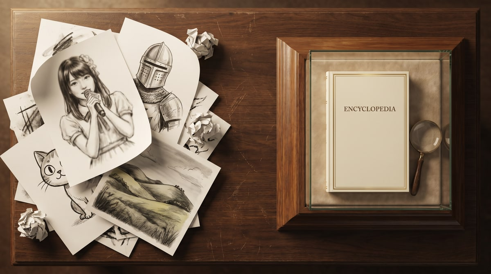

# 我做了 391 张 AI 图鉴，结论是：AI 不会做内容，只会做"像内容的东西"

> 一个 side project 的反 AI 生图手记。从 60 张到 391 张，从"AI 一键搞定"到"AI 生 200 张人工筛 5 张"。

> **封面图**：`docs/blog-2026-06-launch-cover.jpg`（1200w, 109KB）。左堆是 AI 失败品（日系男歌手 / 中世纪战士 / 卡通猫），右是图鉴社的成品。整篇文章的论点就写在这张图里。

---

## 一、5 周前，我想做一件"AI 应该很擅长"的事

事情是这样的。

我是个 side project 控，过去几年业余时间做过各种小工具。但 2026 年最让我困惑的一件事是：**为什么市面上所有的 AI 生图工具，做出来的东西都没法"收藏"？**

每次我跟朋友聊起来：

> "我让 AI 给我生一张'拉布拉多'的图"
> AI 5 秒后给我一张图：构图不错，毛色对，但是一只在沙发上玩球的拉布拉多，背景是奶油色的客厅，旁边坐着一只卡通猫咪。**我没让它画卡通猫咪，它自己加戏了。**

这意味着什么？意味着 **AI 是在生成"一张图"，不是在生成"一张可被系统化、可被比较、可被收藏的图鉴"**。

而图鉴这件事，本质是**系列化**：你收藏了一张拉布拉多，你会想再要一张金毛，再要一只边牧。每一张都需要：
- 同样的版式（主视觉在哪儿、模块在哪儿）
- 同样的字段（基础档案 / 历史沿革 / 养护建议 / 优缺点）
- 同样的视觉调性（"博物馆图鉴"而不是"广告海报"）

如果每次输出都飘忽不定，就不是图鉴，而是"AI 自由发挥合集"。

所以 5 周前我开始做 **图鉴社 (Atlas Kit)** —— 一个专门生成"可系列化中文图鉴"的工具。

---

## 二、5 周做了 391 张，AI 生了大概 1000 张

先说结论，避免剧透反转让大家失望：

**最终上线 391 张。AI 模型大约生成了 1000 张。我自己手动删掉 / 重做 / 改 prompt 触发再生成的，大概 600 张。**

什么意思呢？**AI 生图的"废品率"是 60%。**

听起来很低对吧？我开始做的时候也是这么以为的 —— AI 嘛，prompt 写好就完事。直到遇到下面 4 件事。

### 血泪 #1：你的香气 ≠ Ken Hirai 的 THE CHANGING SAME

15 张音乐卡，是我第一次遇到 AI 的"事实幻觉"。

"你的香气"是 2007 年郭静（台湾女歌手）唱的华语流行曲。我给 AI 的 prompt 是中文 + 英文双标题：

> 「音乐家 / 流行 / 你的香气 / Your Scent / 郭静 / 2007」

AI 给我的图：一位日本男歌手，站在霓虹灯招牌下，CD 封面写着 **"Ken Hirai 2000s J-POP THE CHANGING SAME"**。

我盯着那张图看了 5 秒，意识到 AI 不是"理解"了 prompt，是"匹配"了最相似的训练样本。"Your Scent" → "Ken Hirai 的一段同名时期" → 复刻了一张 Ken Hirai 的 CD 封面。

**AI 把"你的香气"这张图，完完全全画成了另一个主题。**

后来我统计了一下 15 张音乐卡里类似情况：7 张的事实描述有偏差，4 张的图跟主题无关。最后 15 张全部人工重写文本 + 5 张重新生图。

### 血泪 #2：阿甘正传 = "一个普通人的跑步故事"

15 张动漫卡、15 张电影卡，我又踩了一样的坑。

阿甘正传 (Forrest Gump) —— AI 画的图是：一个金发男人在跑道上奔跑，背景是星条旗，色调暖黄。**没有珍妮、没有羽毛、没有巧克力盒、没有乒乓外交**。这是一张"跑步题材"的图，不是一张"阿甘正传"的图。

类似的：
- **低俗小说** → 画成了"两个人在咖啡馆对话"
- **指环王** → 画成了"一个拿着剑的勇士"（没有魔戒，没有霍比特人，没有中土世界）
- **你的名字** → 画成了"日本街道 + 夕阳"

AI 在"识别一个 IP 的视觉锚点"这件事上，弱到可怕。它能识别"科幻"、"中世纪"、"日本"，但识别不了"阿甘正传 = 羽毛 + 长椅 + 巧克力 + Jenny"。

### 血泪 #3：建筑图鉴的 8 个模块，全堆在一个角

我以为博物馆图鉴是最容易做的——建筑嘛，左右对称，几何感强，颜色明确。

错了。AI 画建筑图鉴最大的问题是：**它不懂"图鉴的版式"**。它画的是一张漂亮的建筑摄影，然后我想加"建造年代"、"地理坐标"、"材料工艺"、"代表建筑 4 个"，AI 把这些文字塞到同一个角落，挤成一团乱码。

解决方案是**两步走**：
1. prompt 里严格规定 8 个模块的物理位置（"TOP LEFT: title; TOP RIGHT: era; BOTTOM LEFT: location; BOTTOM RIGHT: materials..."）
2. 防翻车规则里写"do NOT add decorative elements between modules; leave generous white space between sections"

这之后布达拉宫那张图才像个图鉴，而不是"一张漂亮的建筑摄影 + 角落的豆腐块文字"。

### 血泪 #4：汉谟拉比法典 = 巴比伦神话

最后一个血泪是关于"汉谟拉比法典"和"巴比伦神话"的混淆。

法典 = 历史文献（公元前 1754 年颁布的法典）。
神话 = 神话故事（吉尔伽美什史诗、创世神话伊什塔尔下降到冥界...）。

AI 直接给我画了一张"巴比伦风格的飞翼神牛（lamassu）"配文说"汉谟拉比法典"。看着像那么回事，实际上把"法律史"和"神话史"混成了一锅。

**这是 AI 最容易犯的"领域混淆"：当一个文化有多个相关主题时，AI 倾向把它们合并成一个"看起来很'那个文化'"的图。**

---

## 三、所以"AI 一键生成图鉴"到底是什么意思？

走了 4 次坑之后，我对"AI 一键生成"这 5 个字有了完全不同的理解。

**AI 不是"内容生产者"，AI 是"内容加速器"。**

具体到图鉴这件事：

| 环节 | AI 干 | 人工干 |
|---|---|---|
| 选主题（拉布拉多 / 三星堆 / 布达拉宫...） | 不行 | ✅ 决定 |
| prompt 工程（怎么跟 AI 描述这张图鉴） | 90% | 10% 微调 |
| AI 生图 | ✅ 快 | - |
| **事实核查** | ❌ 不可信 | ✅ 必查百度百科 / 维基 |
| **图 vs 主题是否匹配** | ❌ AI 不知道对错 | ✅ 人工比对 |
| **文字描述撰写** | ❌ 一半幻觉 | ✅ 手写 9 模块 |
| **历史沿革** | ❌ 经常编年份 | ✅ 看维基手写 |
| **配色方案** | ✅ 提议色卡 | ✅ 选最匹配的 |
| **反 RPG 审查**（"没稀有度/没星级/没战力"） | ❌ AI 会写 | ✅ 人工删 |
| **9 模块版式排布** | ✅ 但要 prompt 强约束 | ✅ 改 prompt |
| **整体 polish** | - | ✅ 5 轮 design audit |

所以你看到一个图鉴条目背后：
- AI 模型生成了大概 2-3 张候选图
- 人工从里面挑 1 张（或者重做 prompt 触发再生成）
- 9 个文字模块里有 6-8 个是手工写的（或者 handwrite + AI draft + 大量修改）
- 每个事实陈述都得过一遍维基或百度百科
- 整张卡做完后还有反 RPG 检查（删掉任何"稀有"/"战力"/"SSR"词）

**单卡平均制作时间：45 分钟到 1.5 小时。**

5 周 391 张，听起来很快对吧？拆开看：
- AI 生图 + 自动 resize 流程：大概 1-2 小时能跑 50 张
- 人工写文字内容 + 核查事实：每张 30-60 分钟，391 张 = **300-400 小时**

**AI 把"做一张图"从 5 分钟压到 10 秒。但把"做一张能看的图鉴"从 5 分钟压到 30 分钟。AI 把瓶颈从"画"转移到了"知道画什么"和"知道画得对不对"。**

---

## 四、那 AI 到底在哪些地方"真的省了时间"？

不全是血泪。AI 在以下场景是真的帮我提速了：

### 1. "我要 10 种风格试一下" → AI 10 秒给我 10 张，我挑 1 张

挑主题的时候，往往要试 3-5 种视觉方向。传统流程：找参考图 → 找设计 → 自己画草稿 → 出图。AI 流程：写 5 个不同 prompt → 30 秒后看到 5 个方向 → 选定 + 微调。

**这部分确实快了 10 倍以上。**

### 2. "我想看一下这个主题大概什么样子" → AI 给我 30 秒看草稿

写文字之前，我先让 AI 生个草稿图，能直观判断"这个主题适合哪种视觉方向"。

比如"汉谟拉比法典"：是画"石碑"还是"法庭场景"还是"楔形文字特写"？3 个 prompt 跑一下，30 秒后看到 3 张候选，定方向，再让 AI 重做 + 我手写文字。

**这种"探索性"使用是真的快。**

### 3. "批量处理几百张图" → sharp + AI 配合 1 小时搞定

391 张图鉴每张都要 3 个尺寸（缩略图 384w / 主图 600w / 高清原图 1024w），纯 sharp 脚本批量处理，AI 不参与。但图片上传到 CDN（CloudBase）这一步是 AI 相关的 —— 用了 matrix_generate_image 直接上传到 CDN，省了中间下载/上传步骤。

**所以是：AI 生图 + 自动化管线 + CDN + sharp resize，组合起来真的省事。**

---

## 五、5 个"AI 不会做内容"的反直觉事实

走完 5 周 + 391 张，我总结出 5 个反直觉的事实。这些不是抱怨，是观察：

### 1. AI 在"内容创作"上很弱，在"内容生产"上很强

"创作" = 知道要做什么 + 做得对不对。这两件事 AI 都做不好。
"生产" = 重复一个模式 + 高吞吐量。这件事 AI 做得很好。

所以 AI 的最佳用法是**固定模式 + 高吞吐**。不是"自由发挥"。

### 2. AI 的"幻觉率"是个分布，不是个数字

不是"AI 幻觉率 30%"那么简单。AI 在不同领域的幻觉率差异巨大：

- 通用图像（狗 / 猫 / 山）：幻觉率 < 5%
- 风格化插画：幻觉率 10-20%
- 真实人物（歌手 / 演员 / 导演）：幻觉率 **40-60%**（AI 经常画错脸 + 错时代 + 错氛围）
- 文化特定物体（法典 / 仪式 / 文物）：幻觉率 **30-50%**（混淆相关概念）
- 抽象概念（情绪 / 哲学）：幻觉率 60%+（基本没法看）

图鉴社 391 张里，"具体作品"（音乐 / 动漫 / 电影 / 历史人物）的卡废品率最高。"通用自然 / 城市"的卡废品率最低。

### 3. AI 越"通用"，单次输出越好；AI 越"垂直"，你需要给的 prompt 越多

我以为让 AI 画"拉布拉多"应该很简单。结果给 AI 同样的 prompt 10 次，能输出 8 张拉布拉多 + 2 张金毛。**AI 在"识别犬种"这件事上不如 Google Lens。**

要让 AI 输出稳定可系列化的内容，你得：
- 在 prompt 里写清楚"不要添加 prompt 里没提到的元素"
- 在 prompt 里写清楚版式（"留白在 X 处"）
- 防翻车规则："不要混用相似但不同的概念"

**最稳的方式反而是固定 prompt 模板 + 变量替换。** 我做了 12 个分类（pet / animal / city / festival / food / history / music / anime / movie / architecture / craft / phenomenon），每个分类有专属 prompt 模板。这样同分类的 5-30 张图鉴视觉风格一致。

### 4. AI 的"对"是统计意义上的"对"，不是事实上的"对"

AI 说"这是阿甘正传"是因为训练数据里阿甘正传出现很多次，AI 学到了"金发 + 跑步 + 美国南方"这个 pattern。但这不等于 AI 真的理解"阿甘正传"。

这意味着 **你永远不能信 AI 的输出，必须人工核查**。这跟搜索引擎时代不一样，搜索引擎至少是"索引到原文"，AI 是"重新编造一个看起来像原文的东西"。

### 5. "AI 不会做内容"是个机会，不是威胁

这听起来反直觉，但正因为 AI 不会做内容，**做内容的人就更值钱**。

如果 AI 能做内容，那内容生产者就废了。但 AI 做不了内容，所以内容生产者反而成了"AI 生图 + 人工核查"流水线里最关键的环节。

**图鉴社的项目结构是反过来的：不是"AI 生内容 + 人工修饰"，而是"人工定方向 + AI 生草稿 + 人工审查"。** 主导权在人手里，AI 只是工具。

---

## 六、所以图鉴社到底是个什么东西？

5 周 + 391 张 + 反 AI 幻觉的工程实践之后，图鉴社最后长成这个样子：

- **12 个分类 × 13 个系列 × 391 张图鉴**，每张图鉴 9 个固定模块
- **每个模块都是事实驱动**，每个事实陈述都带参考来源（百度百科 / 维基 / 论文）
- **博物馆图鉴的视觉调性**，不是广告海报，不是 AI 自由发挥
- **零稀有度 / 零星级 / 零战力 / 零 SSR**，反 RPG 定位
- **跨卡引用 + 知识图谱**，点开"三星堆"能看到相关的"青铜器 / 古蜀 / 文物"卡
- **localStorage 收藏夹 + PWA**，手机能装能离线
- **MIT 开源**，代码在 github.com/mishishi/atlas-kit

技术栈：**Next.js 14** + **Tailwind** + **CloudBase CDN** + **mavis MCP** + **matrix_generate_image**（中文生图）+ **LocalStorage**。

一个人，5 周，业余时间，0 资金。ship fast，validate with real users.

---

## 七、如果你也对"AI 做内容"这件事有困惑

我觉得图鉴社是一次有意义的实践 —— **证明了 AI 在垂直领域内容上需要"人形骨架 + AI 加速"的组合**，而不是"AI 一键生成"。

下一步想做什么？

- **如果你想看看成品**：[https://atlas-kit-six.vercel.app](https://atlas-kit-six.vercel.app) 或者专门的 [Launch 页面](https://atlas-kit-six.vercel.app/launch)
- **如果你想 fork / 贡献**：[github.com/mishishi/atlas-kit](https://github.com/mishishi/atlas-kit)，MIT，Issues / Discussions 都开着
- **如果你想聊聊 AI 内容产品化**：评论区见，或者邮件 atlas-kit@example.com（暂时占位，欢迎发邮件）

**最后一句话：AI 不会做内容。但会用 AI 的人会做更好的内容。**

这是 2026 年最反直觉的事实，也是做图鉴社 5 周以来最大的收获。

---

*本文写于图鉴社 1.0 发布当天。从 60 张铺满到 391 张深耕，从"AI 一键搞定"到"AI 加速 + 人工深耕"，踩了无数坑，但都写在代码里了。*